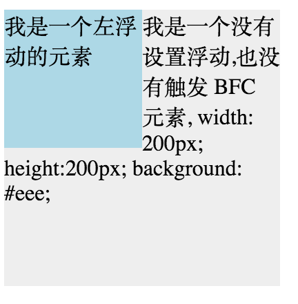

# BFC及其应用

## 一、定义
> BFC 即 Block Formatting Contexts (块级格式化上下文)，是页面盒模型布局中的一种CSS渲染模式，相当于一个独立的容器，里面的元素和外部的元素互相不影响。

## 二、BFC特性
1、 同一个BFC下外边句会发生折叠
```c
<head>
div{
    width: 100px;
    height: 100px;
    background: lightblue;
    margin: 100px;
}
</head>
<body>
    <div></div>
    <div></div>
</body>
```
>从效果上看，因为两个 div 元素都处于同一个 BFC 容器下 (这里指 body 元素) 所以第一个 div 的下边距和第二个 div 的上边距发生了重叠，所以两个盒子之间距离只有 100px，而不是 200px。

首先这不是 CSS 的 bug，我们可以理解为一种规范，如果想要避免外边距的重叠，可以将其放在不同的 BFC 容器中。

```js
<div class="container">
    <p></p>
</div>
<div class="container">
    <p></p>
</div>

.container {
    overflow: hidden;
}
p {
    width: 100px;
    height: 100px;
    background: lightblue;
    margin: 100px;
}
```
>这时候，两个盒子边距就变成了200px


2、BFC 可以包含浮动的元素（清除浮动）
> 我们都知道，浮动的元素会脱离普通文档流

```js
<div style="border: 1px solid #000;">
    <div style="width: 100px;height: 100px;background: #eee;float: left;"></div>
</div>
```
>
由于容器内元素浮动，脱离了文档流，所以容器只剩下 2px 的边距高度。如果使触发容器的 BFC，那么容器将会包裹着浮动元素。

```c
<div style="border: 1px solid #000;overflow: hidden">
    <div style="width: 100px;height: 100px;background: #eee;float: left;"></div>
</div>
```
> 效果如图


3、BFC 可以阻止元素被浮动元素覆盖

```c
<div style="height: 100px;width: 100px;float: left;background: lightblue">
    我是一个左浮动的元素
</div>
<div style="width: 200px; height: 200px;background: #eee">
我是一个没有设置浮动, 也没有触发 BFC 元素, width: 200px; height:200px; background: #eee;
</div>
```
>效果图：

>这时候其实第二个元素有部分被浮动元素所覆盖，(但是文本信息不会被浮动元素所覆盖) 如果想避免元素被覆盖，可触第二个元素的 BFC 特性，在第二个元素中加入 overflow: hidden，就会变成：

这个方法可以用来实现两列自适应布局，效果不错，这时候左边的宽度固定，右边的内容自适应宽度(去掉上面右边内容的宽度)。

## 如何触发BFC
- html 元素。
- float 不是 none 的元素。
- overflow: auto/hidden/scroll 的元素。
- display: table-cell/inline-block 的元素。
- position 不是 static 和 relative 的元素。
