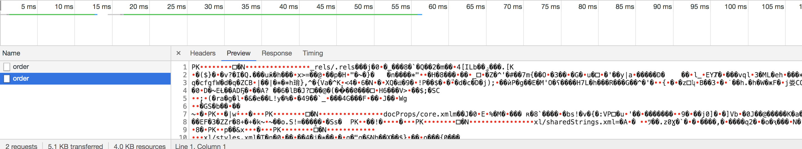

# 上传和下载。
> 前端实现下载文件遇到过的有两种，

- 第一种是服务端返回一个下载地址，这种前端直接可以使用a标签 或者window的downlod方法直接实现下载，这种简单的就不说了。 
- 第二种是服务端以二进制流的形式返回，如果直接在控制台查看全是乱码，不知道的还以为是接口报错了，其实不然。 下面就具体的说一下这种方式的前端实现。
二进制流返回在控制台查看




```c
// 导出
export function exportOrder(data) {
  let url = process.env.BASE_API+'/excel/export/order';
  axios.defaults.withCredentials = true;
  axios.post(url, data, {responseType:'blob' ,headers:{Authorization:getToken()}}).then(function(response) {
    var blob = new Blob([response.data]);
    var downloadElement = document.createElement('a');
    var href = window.URL.createObjectURL(blob);//创建下载的链接
    downloadElement.href = href;
    downloadElement.download = formatDate(new Date(), 'yyyy-MM-dd hh:mm:ss') +'_订单信息 .xlsx';  //下载后文件名
    document.body.appendChild(downloadElement);
    downloadElement.click(); //点击下载
    document.body.removeChild(downloadElement); //下载完成移除元素
    window.URL.revokeObjectURL(href); //释放掉blob对象
  }).catch((r) => {
    console.error(r);
  })
}
 

```

> 代码中几个点解释一下， 如果项目有登陆验证 请求头中需要带上token， 请求的时候responseType:'blob' 需要带着，这样才能取回数据 