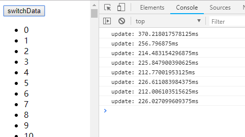

# 写 React / Vue 项目时为什么要在列表组件中写 key，其作用是什么？()

>见vue / patch.js，在不带键的情况下，判断sameVnode时因为a.key和b.key都是未定义，对于列表渲染来说已经可以判断为相同节点然后调用patchVnode了，实际根本不会进入到答主给的其他代码，也就无从谈起“带钥匙比不带钥匙时DIFF算法更高效”了。然后，官网推荐推荐的使用关键，应该理解为“使用唯一ID作为关键。”因为指标作为关键，和不带钥匙的效果是一样的的.index作为重点时，每个列表项的指数在变更前后也是一样的，都是直接判断为sameVnode然后复用。
说到底，关键作用英文的就是更新组件时判断两个节点是否相同。相同就复用，不相同就删除旧的创建新的。
正是因为带唯一按键时每次更新都不能找到可复用的节点，不但要销毁和创建虚拟节点，在DOM里添加移除节点对性能的影响更大。所以会才说“不带钥匙可能性能更好”看下面这个实验，渲染10瓦特列表项，带唯一按键与不带钥匙的时间对比：

- 不使用key的情况
```c
<li v-for="item in list">{{ item.text }}</li>
```


- 使用ID作为key的情况：
```c
 <li v-for="item in list" :key="item.id">{{ n.text }}</li>
```


>列出构造
```c const list1 = []
  const list2 = []
  for (let i = 0; i <= 100000; i++) {
    list1.push({
      id: i,
      text: i
    })
    list2.push({
      id: i * 2,
      name: 100000 - i
    })
  }
  ```
>因为不带key时节点能够复用，省去了销毁/创建组件的开销，同时只需要修改DOM文本内容而不是移除/添加节点，这就是文档中所说的“刻意依赖默认行为以获取性能上的提升”。
既然如此，为什么还要建议带key呢？因为这种模式只适用于渲染简单的无状态组件。对于大多数场景来说，列表组件都有自己的状态。
举个例子：一个新闻列表，可点击列表项来将其标记为"已访问"，可通过tab切换“娱乐新闻”或是“社会新闻”。
不带key属性的情况下，在“娱乐新闻”下选中第二项然后切换到“社会新闻”，"社会新闻"里的第二项也会是被选中的状态，因为这里复用了组件，保留了之前的状态。要解决这个问题，可以为列表项带上新闻id作为唯一key，那么每次渲染列表时都会完全替换所有组件，使其拥有正确状态。
这只是个简单的例子，实际应用会更复杂。带上唯一key虽然会增加开销，但是对于用户来说基本感受不到差距，而且能保证组件状态正确，这应该就是为什么推荐使用唯一id作为key的原因。至于具体怎么使用，就要根据实际情况来选择了。

