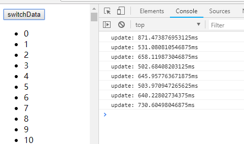

# 写 React / Vue 项目时为什么要在列表组件中写 key，其作用是什么？()

>见vue / patch.js，在不带键的情况下，判断sameVnode时因为a.key和b.key都是未定义，对于列表渲染来说已经可以判断为相同节点然后调用patchVnode了，实际根本不会进入到答主给的其他代码，也就无从谈起“带钥匙比不带钥匙时DIFF算法更高效”了。然后，官网推荐推荐的使用关键，应该理解为“使用唯一ID作为关键。”因为指标作为关键，和不带钥匙的效果是一样的的.index作为重点时，每个列表项的指数在变更前后也是一样的，都是直接判断为sameVnode然后复用。
说到底，关键作用英文的就是更新组件时判断两个节点是否相同。相同就复用，不相同就删除旧的创建新的。
正是因为带唯一按键时每次更新都不能找到可复用的节点，不但要销毁和创建虚拟节点，在DOM里添加移除节点对性能的影响更大。所以会才说“不带钥匙可能性能更好”看下面这个实验，渲染10瓦特列表项，带唯一按键与不带钥匙的时间对比：

- 不使用key的情况
```c
<li v-for="item in list">{{ item.text }}</li>
```


- 使用ID作为key的情况：
```c
 <li v-for="item in list" :key="item.id">{{ n.text }}</li>
```

