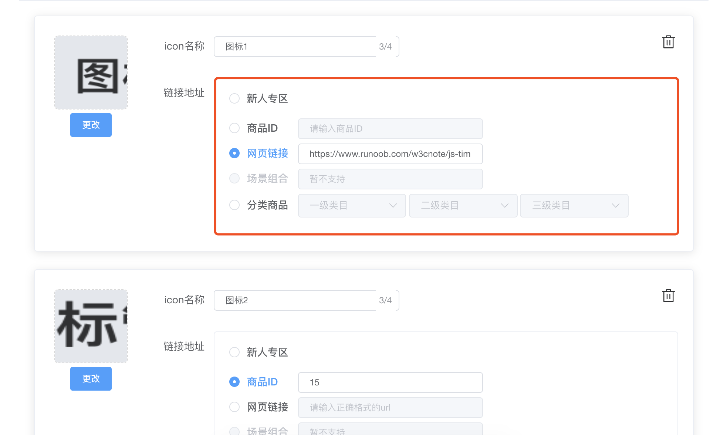

## vue表单编辑信息无效的坑

> 今天在项目中遇到一个问题 ，我在写表单组件的时候并不是单纯的绑定，回填的时候在组件里面需要根据type类型，赋值不同的内容给表单组件



直接贴代码
```c
<template> 
  <div style="margin-bottom:24px; position: relative" >
      <el-card class="box-card">
        <div class='delete' @click='deleteItem(form.note)'>
          <i class="el-icon-delete"></i>
        </div>
        <el-col :span='4'>
          <single-upload
            v-model="form.picUrl"
          ></single-upload>
        </el-col>
        <el-col :span="20">
          <el-form-item label="icon名称" >
            <el-input  
              size="mini" 
              maxlength="4"
              minlength="2"
              show-word-limit
              placeholder="请输入2-4个字符"
              style="width: 40%" 
              v-model="form.name"></el-input>
          </el-form-item>
          <el-form-item label="链接地址" prop="radio">
            <el-card class="box-card" shadow="never">
              <el-radio-group v-model="form.urlType" >
                <div class="divHeight">
                  <el-radio :label="5">
                    <span class="spanwidth">新人专区</span>
                  </el-radio>
                </div>
                <div class="divHeight">
                  <el-radio :label="1">
                    <span class="spanwidth">商品ID</span>
                      <el-input 
                        :disabled="form.urlType !== 1"
                        placeholder="请输入商品ID"
                        size="mini" 
                        v-model="form.productID">
                      </el-input>
                  </el-radio>
                </div>
                <div class="divHeight">
                  <el-radio :label="2">
                    <span class="spanwidth">网页链接</span>
                      <el-input  
                        :disabled="form.urlType !== 2"
                        size="mini" 
                        placeholder="请输入正确格式的url"
                        @input="urlBlur" 
                        v-model="form.urlAdd">
                      </el-input>
                  </el-radio>
                </div>
                <div class='divHeight'>
                  <el-radio
                    :disabled="true"
                    :label="3">
                    <span class="spanwidth">场景组合</span>
                      <el-input 
                        :disabled="form.urlType !== 3"
                        size="mini" 
                        placeholder="暂不支持"
                        v-model="form.scance"></el-input>
                  </el-radio>
                </div>
                <div class='divHeight'>
                  <el-radio :label="4">
                    <span class="spanwidth">分类商品</span>
                    <three-cate
                      @getAddress="changeAddress"
                      :listQuery = "form.listQuery"
                      :listQueryList = 'form.listQueryList'
                      :isShow="form.urlType !== 4"
                    ></three-cate>
                  </el-radio>
                </div>
              </el-radio-group>
            </el-card>
          </el-form-item>
        </el-col>
      </el-card>
    </div>
  </template>
  <script>
    import  SingleUpload  from '@/components/Upload/singleUploadIcon'
    import { validateURL } from '@/utils/validate'
    import ThreeCate from './threeCate'
    import _ from 'lodash'
    export default {
      name: 'iconManage',
      components: { SingleUpload, ThreeCate },
      data() {
        return {
        }
      },
      props:[
        'form',
        'deleteItem',
      ],
      created() {
        const { 
              urlType,
              url,
            } = this.form;
          if(urlType === 1){
            this.form.productID = url
          }else if(urlType === 2){
            this.form.urlAdd = url
          }else if(urlType === 3){
            this.form.scance = url
          }else if(urlType === 4){
            const arr = url ? url.split('#') : [];
            this.form.listQuery.productFi = arr[1] && JSON.parse(arr[1])
            this.form.listQuery.productSe = arr[2] && JSON.parse(arr[2])
            this.form.listQuery.productTh = arr[3] && JSON.parse(arr[3])
          }
      },
      computed: {
      },
      methods: {
        changeAddress(data){
          this.form.listQuery = _.cloneDeep(data.listQuery)
          this.form.listQueryList = _.cloneDeep(data.listQueryList)
        },
        // url 校验
        urlBlur(value){
          if(this.form.urlType === 2){
            if(this.urlAdd === ''){
              this.$message({
                type: 'warning',
                message: '链接不能为空！',
                duration:1000
              });
              return;
            }
            if(!validateURL(this.urlAdd)){
              this.$message({
                type: 'warning',
                message: '请输入正确的url链接地址',
                duration:1000
              });
              return;
            }
          }
        },
      }
    }
  </script>
  <style rel="stylesheet/scss" lang="scss" scoped>

  </style>

```

> 如上代码 是我封装的每一个表单。 问题就出在creaete钩子里面，因为我对传进来的form.productID\form.urlAdd\form.scane\新赋值了 然后就会出现在编辑回填的时候 是不可编辑的。

> 后来google了下 说是因为没有在data里面注册导致的， 然后我就在data里面重新注册维护，用watch监听， 重新赋值给form从而解决了问题

```c
<template> 
  <div style="margin-bottom:24px; position: relative" >
      <el-card class="box-card">
        <div class='delete' @click='deleteItem(form.note)'>
          <i class="el-icon-delete"></i>
        </div>
        <el-col :span='4'>
          <single-upload
            v-model="form.picUrl"
          ></single-upload>
        </el-col>
        <el-col :span="20">
          <el-form-item label="icon名称" >
            <el-input  
              size="mini" 
              maxlength="4"
              minlength="2"
              show-word-limit
              placeholder="请输入2-4个字符"
              style="width: 40%" 
              v-model="form.name"></el-input>
          </el-form-item>
          <el-form-item label="链接地址" prop="radio">
            <el-card class="box-card" shadow="never">
              <el-radio-group v-model="form.urlType" >
                <div class="divHeight">
                  <el-radio :label="5">
                    <span class="spanwidth">新人专区</span>
                  </el-radio>
                </div>
                <div class="divHeight">
                  <el-radio :label="1">
                    <span class="spanwidth">商品ID</span>
                      <el-input 
                        :disabled="form.urlType !== 1"
                        placeholder="请输入商品ID"
                        size="mini" 
                        v-model="productID">
                      </el-input>
                  </el-radio>
                </div>
                <div class="divHeight">
                  <el-radio :label="2">
                    <span class="spanwidth">网页链接</span>
                      <el-input  
                        :disabled="form.urlType !== 2"
                        size="mini" 
                        placeholder="请输入正确格式的url"
                        @input="urlBlur" 
                        v-model="urlAdd">
                      </el-input>
                  </el-radio>
                </div>
                <div class='divHeight'>
                  <el-radio
                    :disabled="true"
                    :label="3">
                    <span class="spanwidth">场景组合</span>
                      <el-input 
                        :disabled="form.urlType !== 3"
                        size="mini" 
                        placeholder="暂不支持"
                        v-model="scance"></el-input>
                  </el-radio>
                </div>
                <div class='divHeight'>
                  <el-radio :label="4">
                    <span class="spanwidth">分类商品</span>
                    <three-cate
                      @getAddress="changeAddress"
                      :listQuery = "form.listQuery"
                      :listQueryList = 'form.listQueryList'
                      :isShow="form.urlType !== 4"
                    ></three-cate>
                  </el-radio>
                </div>
              </el-radio-group>
            </el-card>
          </el-form-item>
        </el-col>
      </el-card>
    </div>
  </template>
  <script>
    import  SingleUpload  from '@/components/Upload/singleUploadIcon'
    import { validateURL } from '@/utils/validate'
    import ThreeCate from './threeCate'
    import _ from 'lodash'
    export default {
      name: 'iconManage',
      components: { SingleUpload, ThreeCate },
      data() {
        return {
          productID: null,
          urlAdd: null,
          scance: null,
        }
      },
      watch: {
        productID: function(){
          this.form.productID = this.productID
        },
        urlAdd: function(){
          this.form.urlAdd = this.urlAdd
        },
        scance: function(){
          this.form.scance = this.scance
        },
      },
      props:[
        'form',
        'deleteItem',
      ],
      created() {
        const { 
              urlType,
              url,
            } = this.form;
          if(urlType === 1){
            this.form.productID = url
            this.productID = url
          }else if(urlType === 2){
            this.form.urlAdd = url
            this.urlAdd = url
          }else if(urlType === 3){
            this.form.scance = url
            this.scane = url
          }else if(urlType === 4){
            const arr = url ? url.split('#') : [];
            this.form.listQuery.productFi = arr[1] && JSON.parse(arr[1])
            this.form.listQuery.productSe = arr[2] && JSON.parse(arr[2])
            this.form.listQuery.productTh = arr[3] && JSON.parse(arr[3])
          }
      },
      computed: {
      },
      methods: {
        changeAddress(data){
          this.form.listQuery = _.cloneDeep(data.listQuery)
          this.form.listQueryList = _.cloneDeep(data.listQueryList)
        },
        // url 校验
        urlBlur(value){
          if(this.form.urlType === 2){
            if(this.urlAdd === ''){
              this.$message({
                type: 'warning',
                message: '链接不能为空！',
                duration:1000
              });
              return;
            }
            if(!validateURL(this.urlAdd)){
              this.$message({
                type: 'warning',
                message: '请输入正确的url链接地址',
                duration:1000
              });
              return;
            }
          }
        },
      }
    }
  </script>
  <style rel="stylesheet/scss" lang="scss" scoped>
  </style>
  
```